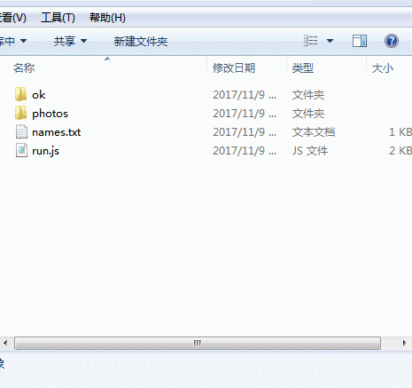

## batch naming photos
    @Desc: 将照片按照人员姓名批量命名
    @Update: 2017-11-09
---
   

- 将需要处理的照片放到 `photos` 文件夹下；
    
        `demoPhotos` 文件夹存放有示例照片。

- 按照片**升序**的顺序将对应的人员姓名写到 `names.txt` 文件中（也可以先通过 Excel 收集人员姓名，再一次性把姓名文字复制到 names.txt 中 ），一行一个；
- 定位到 `run.js` 所在目录，运行 `node run`；
- 照片将按姓名顺序重命名，并保存到 `ok` 文件夹下。